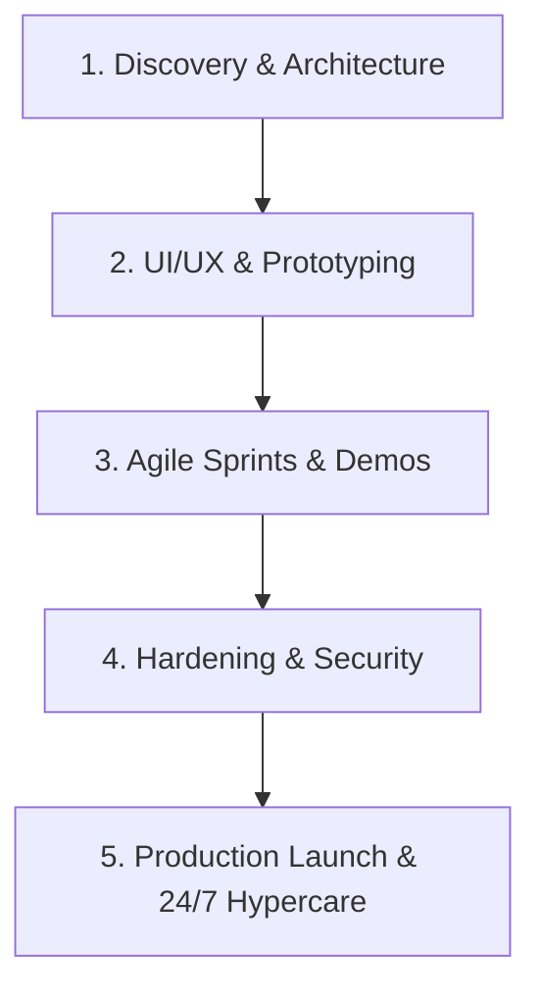

<div align="center">

# ⚡ Alpha AI Services
### Enterprise AI Architecture • Custom Software Engineering • Modern Digital Product Studio

[](https://alphaaiservices.in)
[](mailto:info@alphaaiservices.in)
[](https://wa.me/918381835420)
[](https://www.linkedin.com/in/tiwarijii)
[](https://www.instagram.com/alphaaiservices.in/?hl=en)

<p align="center">
  <strong>Alpha AI Services</strong> is an elite software engineering and artificial intelligence studio based in India. We design, build, and deploy production-grade software applications, custom LLM systems, scalable web & mobile platforms, and high-velocity digital products for high-growth startups and global enterprises.
</p>

</div>

---

## 🚀 About Our Business & Mission

At **Alpha AI Services**, we bridge the gap between cutting-edge artificial intelligence and rock-solid enterprise software engineering. We don't build superficial prototypes — we engineer robust, resilient, scalable digital systems built for commercial impact.

* **Headquarters:** Prayagraj, Uttar Pradesh, India
* **Remote Engineering Hub:** Pune, Maharashtra, India
* **Global Operations:** Delivering engineering sprints and monthly technology retainers worldwide
* **Client IP Ownership:** 100% full source code, model weights, and design ownership transferred to clients upon milestone completion

---

## 🛠️ Core Engineering Practices & Services

### 1. 🧠 Custom AI & Intelligent Systems
* **RAG Architectures & Vector Search:** Low-latency retrieval-augmented generation pipelines using pgvector, Pinecone, and Qdrant.
* **LLM Fine-Tuning & Orchestration:** Gemini, Llama, Mistral, and Claude model customization with structured function-calling and guardrails.
* **Autonomous Multi-Agent Swarms:** Self-healing workflows for autonomous research, reconciliation, and automated operational tasks.

### 2. 💻 Full-Stack Software & Web Application Engineering
* **Modern Web Architectures:** High-conversion web applications built on React 19, TypeScript, Next.js, and Vite with sub-second page loads.
* **Microservices & Distributed Backends:** High-throughput transactional APIs engineered with Go, Python (FastAPI), Node.js, and PostgreSQL.
* **Design Systems & Micro-Interactions:** Custom UI/UX design systems with fluid motion ergonomics and complete accessibility (WCAG 2.1 AA).

### 3. 📱 Native & Cross-Platform Mobile Applications
* **iOS & Android Engineering:** Fluid mobile apps built with React Native and Flutter, featuring offline SQLite sync, biometrics, and push infrastructure.

### 4. ☁️ Cloud Architecture, DevOps & Cybersecurity
* **Zero-Downtime CI/CD:** Automated testing pipelines, Docker containerization, and multi-region Kubernetes clusters.
* **Security & Compliance:** Zero-trust architecture, envelope encryption (AES-256 / TLS 1.3), SOC2-ready governance, and compliance with the **Digital Personal Data Protection (DPDP) Act, 2023**.

### 5. 🔄 Monthly Technology Retainers & Digital Growth
* **Continuous Engineering Sprints:** Dedicated developer bandwidth for ongoing feature expansion, security updates, and performance tuning.
* **Social Media & Creative Execution:** Strategic digital growth support, visual asset creation, and brand engineering.

---

## 🏆 Featured Case Studies & Work

| Project | Domain | Technologies | Impact & Highlights |
| :--- | :--- | :--- | :--- |
| **SeHAT SmartCare** | Telehealth & AI Diagnostics | React 19, TypeScript, WebRTC, Gemini AI, Tailwind CSS | Real-time encrypted teleconsultations, AI symptom triage with multi-language transcription, and sub-100ms vital streaming. |
| **TOMATO 3D** | Interactive WebGL E-Commerce | Three.js, WebGL, React 19, Framer Motion, TypeScript | Ultra-smooth 60 FPS 3D food customizer and interactive ordering interface with photorealistic WebGL shaders. |
| **AI Business Assistant** | Enterprise Copilot & RAG | FastAPI, React, pgvector, LangChain, PostgreSQL | Internal knowledge copilot with verifiable document attribution, strict role-based data access, and instant natural language querying. |

---

## ⚙️ 5-Stage Engineering Process



1. **Deep Discovery & Technical Feasibility:** Architectural blueprints, database schemas, threat modeling, and formal PRD.
2. **Interactive UX & Prototyping:** Clickable Figma prototypes, design tokens, and ergonomics review.
3. **Rapid Agile Sprints:** Bi-weekly milestone demonstrations, automated unit/integration tests, and continuous client visibility.
4. **Hardening & Security Audits:** Load testing, penetration checks, Lighthouse Core Web Vitals optimization, and zero-defect QA.
5. **Production Deployment & SLA Hypercare:** Zero-downtime release, full IP handover, and ongoing monthly retainer maintenance.

---

## 💻 Tech Stack Behind This Platform

* **Frontend Framework:** React 19 + TypeScript
* **Build Engine:** Vite 6 (esbuild minification, manual vendor chunking)
* **Styling:** Tailwind CSS v4 (Glassmorphism, custom typography)
* **Motion & Interactions:** Framer Motion (`motion/react`) with reduced-motion support
* **Icons:** Lucide React
* **SEO & GEO Engine:** Dynamic JSON-LD Schema.org graphs (Organization, LocalBusiness, Breadcrumbs, FAQPage), XML Sitemap, and LLM Markdown (`llms.txt`)

---

## 🛠️ Local Development & Setup

### Prerequisites
* [Node.js](https://nodejs.org/) (version 18.0 or higher recommended)
* `npm` or `yarn` or `pnpm`

### Installation Steps

1. **Clone the repository:**
   ```bash
   git clone https://github.com/tiwariji7/Alpha-Ai-Services.git
   cd Alpha-Ai-Services
   ```

2. **Install dependencies:**
   ```bash
   npm install
   ```

3. **Start the local development server:**
   ```bash
   npm run dev
   ```
   Open [http://localhost:3000](http://localhost:3000) in your browser.

4. **Compile production build:**
   ```bash
   npm run build
   ```

5. **Preview production bundle:**
   ```bash
   npm run preview
   ```

---

## 📬 Contact & Commercial Inquiries

Ready to build or scale your next digital product? Connect with our engineering team:

* 🌐 **Official Website:** [https://alphaaiservices.in](https://alphaaiservices.in)
* ✉️ **Direct Email:** [info@alphaaiservices.in](mailto:info@alphaaiservices.in)
* 💬 **WhatsApp Direct:** [Chat on WhatsApp](https://wa.me/918381835420) (+91 83818 35420)
* 💼 **LinkedIn:** [linkedin.com/in/tiwarijii](https://www.linkedin.com/in/tiwarijii)
* 📸 **Instagram:** [@alphaaiservices.in](https://www.instagram.com/alphaaiservices.in/?hl=en)
* 🐙 **GitHub:** [github.com/tiwariji7](https://github.com/tiwariji7)

---

<div align="center">
  <sub>© 2026 Alpha AI Services. All rights reserved. Built with precision and passion.</sub>
</div>
